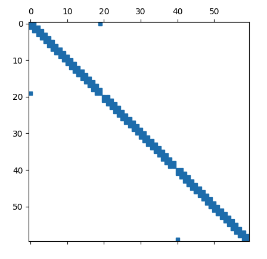
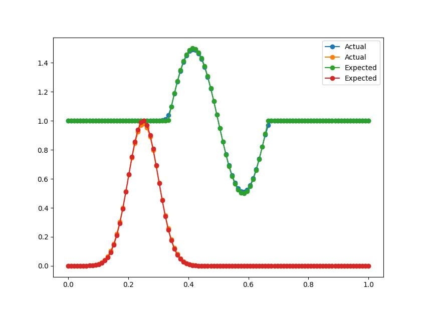

# Sparse Jacobian Benchmark

There is a benchmark that is included (also written as a `pytest` test), which compares the time it takes to generate both a sparse and dense Jacobian. The results are as follows:

For N=250, 

| Method    | Time       | 
|-----------|------------|
| Dense   |    ~45 seconds |
| Sparse |  ~0.6 seconds  |

The benchmark can be executed from the parent folder using the command

`python -m pytest -s benchmark`

The sparsity pattern of the Jacobian for the multi-split approach (split locations at 1, 2) is as follows. Both `split` parameter and boundary conditions lead to wrap-around and reshuffle of the sparse entries, which are correctly captured and match with the dense Jacobian entries. Note that the image is shown for N=20 for better representation. Also, 

# Solver Verification

One of the tests in the `tests` folder is a verification test for the solver. This involves advecting the initial condition of a multi-dimensional problem in a 1D domain with a constant velocity and comparing the solution to the initial condition after one cycle over the domain.

