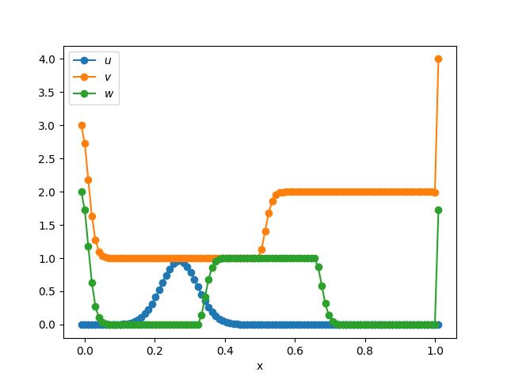

# Advection-Diffusion

This tutorial will walk you through the process of setting up an advection-diffusion problem using `splitfxm`. This is provided by default in the `splitfxm.models` module.

## Problem Setup

First, we need to import the necessary modules and create a domain for the problem.

```python
from splitfxm.domain import Domain
from splitfxm.simulation import Simulation
from splitfxm.models.advection_diffusion import AdvectionDiffusion
from splitfxm.schemes import default_scheme
from splitfxm.visualize import draw
```

Next, we need to define the method we are going to use. This can be either `FDM` or `FVM`.

Then, the domain can be created using the `Domain.from_size` method. The first argument is the number of cells in the x-direction, the second argument is the number of ghost cells on the left and right sides, and the third argument is the number of ghost cells on the bottom and top sides.


```python
# Define the problem
method = 'FDM'
m = AdvectionDiffusion(c=0.2, nu=0.001, method=method)

# nx, nb_left, nb_right, variables
d = Domain.from_size(100, 1, 1, ["u", "v", "w"])
```

Once this is done, we can define the initial conditions and boundary conditions.

```python
# Initial conditions
ics = {"u": "gaussian", "v": "rarefaction", "w": "tophat"}

# Boundary conditions
bcs = {
    "u": {
        "left": "periodic",
        "right": "periodic"
    },
    "v": {
        "left": {"dirichlet": 3},
        "right": {"dirichlet": 4}
    },
    "w": {
        "left": {"dirichlet": 2},
        "right": "periodic"
    }
}
```

## Simulation Setup

Now, we need to create a simulation object.

```python
s = Simulation(d, m, ics, bcs, default_scheme(method))
```

## Evolve the System

We can now evolve the system in time using the `evolve` method.

```python
s.evolve(t_diff=0.1)
```

## Visualize the Results

Finally, we can visualize the results using the `draw` function.

```python
draw(d, "label")
```

The results should look like this:

