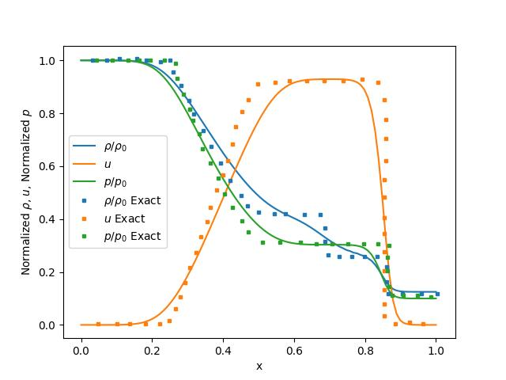

# Sod Shock Tube

This tutorial will walk you through the process of setting up a Sod Shock Tube problem using `splitfxm`.

## Problem Setup

First, we need to import the necessary modules and create a domain for the problem.

```python
from splitfxm.domain import Domain
from splitfxm.simulation import Simulation
from euler1d import Euler1DConservative
from splitfxm.schemes import default_scheme
```

Next, we need to define the method we are going to use. It is preferable to use FVM for shock tubes.

We need to define the equations to use for this problem. The `Euler1DConservative` class is provided for this purpose. It is a class that represents the 1D Euler equations for compressible fluid flow and is a special case of the Advection-Diffusion equations.

Note that the expressions for `Euler1DConservative` are quite complicated and only the final results are provided here. The derivation of the expressions is provided in the `flux_jacobian.py` file.

Note that the `dFdU` function represents the derivative of the flux function with respect to the state vector `U`. This can be symbolically computed using `sympy` and the flux function, the program for which is provided in the `flux_jacobian.py`. The expressions are as follows:

The flux is given by:
```plain
⎡                  U₂                  ⎤
⎢                                      ⎥
⎢     2           ⎛              2⎞    ⎥
⎢   U₂  + (γ - 1)⋅⎝U₁⋅U₃ - 0.5⋅U₂ ⎠    ⎥
⎢   ───────────────────────────────    ⎥
⎢                 U₁                   ⎥
⎢                                      ⎥
⎢   ⎛                ⎛              2⎞⎞⎥
⎢U₂⋅⎝U₁⋅U₃ + (γ - 1)⋅⎝U₁⋅U₃ - 0.5⋅U₂ ⎠⎠⎥
⎢──────────────────────────────────────⎥
⎢                   2                  ⎥
⎣                 U₁                   ⎦
```

and similarly the Jacobian of the flux is given by:
```plain
⎡               0                                    1                       0  ⎤
⎢                                                                               ⎥
⎢         2                                                                     ⎥
⎢       U₂ ⋅(0.5⋅γ - 1.5)                    U₂⋅(3.0 - 1.0⋅γ)                   ⎥
⎢       ─────────────────                    ────────────────              γ - 1⎥
⎢                2                                  U₁                          ⎥
⎢              U₁                                                               ⎥
⎢                                                                               ⎥
⎢       ⎛             2       2⎞      ⎛                    2           2⎞       ⎥
⎢1.0⋅U₂⋅⎝-U₁⋅U₃⋅γ + U₂ ⋅γ - U₂ ⎠  1.0⋅⎝1.0⋅U₁⋅U₃⋅γ - 1.5⋅U₂ ⋅γ + 1.5⋅U₂ ⎠  U₂⋅γ ⎥
⎢───────────────────────────────  ───────────────────────────────────────  ──── ⎥
⎢                3                                    2                     U₁  ⎥
⎣              U₁                                   U₁                          ⎦
```

Then, the domain can be created using the `Domain.from_size` method.

```python
# Define the problem
method = 'FVM'
# Euler equations with gamma for ideal gas
m = Euler1DConservative(gamma=1.4, method=method)

# Create a domain for the shock tube
# nx = number of cells, nb_left = 1 ghost cell, nb_right = 1 ghost cell
# Variables: ["rho", "u", "p"] (density, velocity, pressure)
d = Domain.from_size(100, 1, 1, ["rho", "rhou", "E"])
```

Once this is done, we can define the initial conditions and boundary conditions. The initial conditions are going to be set afterwards. The boundary conditions are transmissive (or Neumann with zero derivative) for both sides.

```python
# Boundary conditions (transmissive for both sides)
ics = {}
bcs = {"rho": {"left": {"neumann": 0.}, "right": {"neumann": 0.}},
       "rhou": {"left": {"neumann": 0.}, "right": {"neumann": 0.}},
       "E": {"left": {"neumann": 0.}, "right": {"neumann": 0.}}}
```

Now, we can create a simulation object.

```python
s = Simulation(d, m, ics, bcs, default_scheme(method))
```

## Initial Conditions

We can now set the initial conditions for the domain. The initial conditions are set using the `set_value` method of the `Domain` class.

```python
for cell in s._d.interior():
    cell.set_value(s._d.component_index("rho"),
                   1.0 if cell.x() < 0.5 else 0.125)
    cell.set_value(s._d.component_index("rhou"), 0.0)
    cell.set_value(s._d.component_index("E"), 2.5 if cell.x() < 0.5 else 0.25)
```

## Evolve the System

We can now evolve the system in time using the `evolve` method. The default method uses `RK45` for the time integration. You can also use Split-Newton to re-order the variables, although its benefits are more for steady-state problems.

```python
s.evolve(split=True, split_loc=1, t_diff=0.2)
```

## Visualize the Results

We can visualize the conservative variables using the `draw` function. However, if we want to visualize the primitive variables, we can use the `conservative_to_primitive` method of the `Euler1DConservative` class.

```python
values = [m.conservative_to_primitive(cell_values)
          for cell_values in s._d.values(interior=True)]
plt.plot(d.positions(interior=True), values, "-o")
```

The results should look like this:

