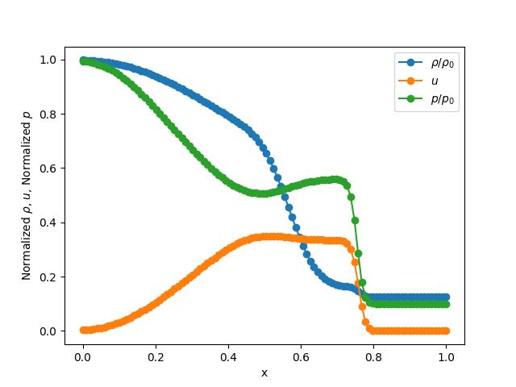

# Sod Shock Tube

This tutorial will walk you through the process of setting up a Sod Shock Tube problem using `splitfxm`.

## Problem Setup

First, we need to import the necessary modules and create a domain for the problem.

```python
from splitfxm.domain import Domain
from splitfxm.simulation import Simulation
from euler import Euler1D
from splitfxm.schemes import default_scheme
from splitfxm.visualize import draw
```

Next, we need to define the method we are going to use. It is preferable to use FVM for shock tubes.

We need to define the equations to use for this problem. The `Euler1D` class is provided for this purpose. It is a class that represents the 1D Euler equations for compressible fluid flow and is a special case of the Advection-Diffusion equations.

The code for the `Euler1D` class is as follows:
```python
class Euler1D(Model):
    """
    A class representing the 1D Euler equations for compressible fluid flow.
    Parameters
    ----------
    gamma : float
        The adiabatic index (ratio of specific heats).
    method : str
        The numerical method to use, either 'FDM' or 'FVM'.
    """
    def __init__(self, gamma=1.4, method='FDM'):
        """
        Initialize an `Euler1D` object.
        """
        self.gamma = gamma
        # Define the flux function for Euler equations
        def F(U):
            rho, u, p = U
            E = p / (self.gamma - 1) + 0.5 * rho * u**2  # Total energy
            return np.array([rho * u, rho * u**2 + p, u * (E + p)])
        # Diffusion term (not used in standard Euler equations, but can be extended)
        def D(U):
            return np.zeros_like(U)  # No diffusion term in the Euler equations
        # Source term (assuming no external forces, source term is zero)
        def S(U):
            return np.zeros_like(U)
        # Derivative of the flux function with respect to the state vector U
        def dFdU(U):
            rho, u, p = U
            # Obtained from flux_jacobian.py
            dF_matrix = np.array([
                [u, rho, 0],
                [u**2, 2*rho*u, 1],
                [0.5*(u**3.), 1.5*rho*(u**2.) + gamma*p /
                 (gamma - 1.), gamma*u/(gamma - 1.)]
            ])
```

Note that the `dFdU` function represents the derivative of the flux function with respect to the state vector `U`. This can be symbolically computed using `sympy` and the flux function, the program for which is provided in the `flux_jacobian.py` file, which is as follows:

```python
import sympy as sp
# Define symbols
rho, u, p, gamma = sp.symbols('rho u p gamma')
# Define the energy term
E = p / (gamma - 1) + 0.5 * rho * u**2  # Assuming gamma = 1.4
# Define the flux function F
F = sp.Matrix([
    rho * u,                # F1
    rho * u**2 + p,        # F2
    u * (E + p)            # F3
])
# Calculate the Jacobian dF/dU
dF_dU = F.jacobian([rho, u, p])

# Display the result
sp.pprint(dF_dU)
```

The output of the above code is as follows:
```plain
⎡  u              ρ                  0      ⎤
⎢                                           ⎥
⎢   2                                       ⎥
⎢  u            2⋅ρ⋅u                1      ⎥
⎢                                           ⎥
⎢     3        p            2    ⎛      1  ⎞⎥
⎢0.5⋅u   p + ───── + 1.5⋅ρ⋅u   u⋅⎜1 + ─────⎟⎥
⎣            γ - 1               ⎝    γ - 1⎠⎦
```

Then, the domain can be created using the `Domain.from_size` method.

```python
# Define the problem
method = 'FVM'
# Euler equations with gamma for ideal gas
m = Euler1D(gamma=1.4, method=method)

# Create a domain for the shock tube
# nx = number of cells, nb_left = 1 ghost cell, nb_right = 1 ghost cell
# Variables: ["rho", "u", "p"] (density, velocity, pressure)
d = Domain.from_size(100, 1, 1, ["rho", "u", "p"])
```

Once this is done, we can define the initial conditions and boundary conditions. The initial conditions are going to be set afterwards. The boundary conditions are transmissive (or Neumann with zero derivative) for both sides.

```python
# Boundary conditions (transmissive for both sides)
ics = {}
bcs = {"rho": {"left": {"neumann": 0.}, "right": {"neumann": 0.}},
       "u": {"left": {"neumann": 0.}, "right": {"neumann": 0.}},
       "p": {"left": {"neumann": 0.}, "right": {"neumann": 0.}}}
```

Now, we can create a simulation object.

```python
s = Simulation(d, m, ics, bcs, default_scheme(method))
```

## Initial Conditions

We can now set the initial conditions for the domain. The initial conditions are set using the `set_value` method of the `Domain` class.

```python
for cell in s._d.interior():
    cell.set_value(s._d.component_index("rho"),
                   1.0 if cell.x() < 0.5 else 0.125)
    cell.set_value(s._d.component_index("u"), 0.0)
    cell.set_value(s._d.component_index("p"), 1. if cell.x() < 0.5 else 0.1)
```

## Evolve the System

We can now evolve the system in time using the `evolve` method. The default method uses `RK45` for the time integration. You can also use Split-Newton to re-order the variables, although its benefits are more for steady-state problems.

```python
s.evolve(split=True, split_loc=1, t_diff=0.2)
```

## Visualize the Results

Finally, we can visualize the results using the `draw` function.

```python
draw(s._d, "Sod Shock Tube", interior=True)
```

The results should look like this:

